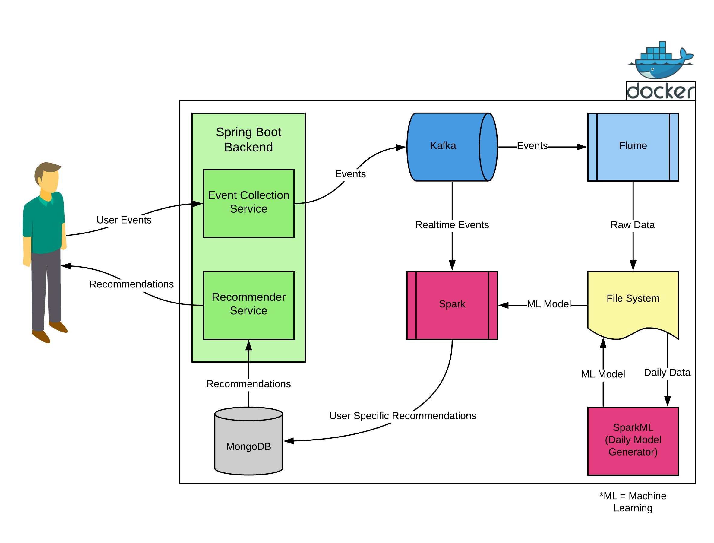

# Recommendation Engine - Docker Files

## Description
This repository contains the docker-compose file for the tools used in our recommender engine. The docker-compose file includes Kafka, Flume, Zookeeper, Spring Boot, MongoDB and Spark. Architecture of the project is visualized in figure below.

	Figure 1: Visualized architecture of the project.

## Usage
There are 2 YAML files which can be used to up the system. One can be used to up the system with currently built images, the other one can be used to up the system by building the images from scratch.

If you run `docker-compose up` command in the root directory of this repository, all services of the system run with their own docker images. These images will be placed in this GitHub repository, i.e. currently this scenario is not available.

Dockerfiles (Flume, Spark Master, Spark Worker and Spring Boot) of the services are also provided under images directory in this repository. If you change the Dockerfiles, run the command `docker-compose -f docker-compose-with-build.yml up` to up the whole system.

## JARs
Spark Master, Spark Worker and Spring Boot services need JAR files to run ML, Streaming and Spring Boot applications. We package those JARs using Maven and SBT from related repositories and put them into releases sections of the related repositories. We download those JARs in the related Dockerfiles using the links below.

* For the web service component:
  * https://github.com/trendyol-data-eng-summer-intern-2019/recom-engine-web-service/releases/latest
* For the streaming component:
  * https://github.com/trendyol-data-eng-summer-intern-2019/recom-engine-streaming/releases/latest
* For the ml component:
  * https://github.com/trendyol-data-eng-summer-intern-2019/recom-engine-ml/releases/latest

## Members
- [Oğuzhan Bölükbaş](https://github.com/oguzhan-bolukbas)
- [Sercan Ersoy](https://github.com/sercanersoy)
- [Yasin Uygun](https://github.com/yasinuygun)
